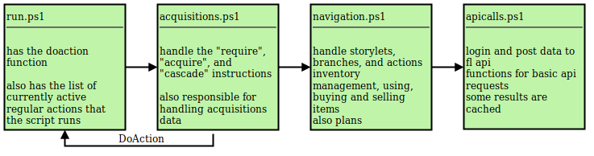

# FallenLondon Grinder

Azure function set up to run every 10 minutes. Will cycle through a given set of storylets and choices in fallen london, as long as there are actions to spare.

Most of the following describes the original, powershell port, but most of the descriptions should be relevant for the cs port. The powershell port is now deprecated.

## how

An `action` is a sequence of navigational clicks in fallen london. They are simple strings, divided into different parts by commas.

`action.json` contains a list of actions. Each time the script runs, one of those actions are performed. Which action is chosen based on the date. Each day that passes progresses one step further in the list of actions. When the list is done, it restarts from the beginning.

### types of actions

#### normal, boring action

The string is divided into location, name of storylet, then an optional number of branch navigations, then at the end a choice.

The location is the area you wish to move to. The full name of an area will always work as long as you know the route. Some care has been taken to accept shorthand names, look for `$script:locations` in `apicalls.ps1`. If location is carnival then tickets will be automatically acquired. If location is shuttered palace, an action will be spent to gain access. Other locations may have other custom handling applied.

Storylet and branch name lookup is done using the `-match` operator. You can also supply an index number (starting at 1), or a question mark for a random selection. Multiple options can be given, separated by forward-slashes. In that case they will be tried one after another, left-to-right, until one works.

#### require

Most of the time you don't want to do a specific action, rather you want to gain and grind inventory items and stats. Fortunately we have the aquisitions engine to take care of more complicated actions. In it you can specify that an action has prerequisite inventory or stats, and in turn give instructions on how to fulfill those before proceeding. The prerequisites can in turn have their own prerequisites and so on.

The format is `require,<possession category>,<possession name>,<amount>[,<named action>]`. Remember that even stats are possessions in this game, so you could for example require "Accomplishments,A Person of Some Importance,1" if you need PoSI for something.

The named action is optional, but helpful if you need to specify exactly which acquisition to use to grind something. There may, for example, be different actions to raise and lower specific qualities. If no action is named, the acquisitions engine will make a best effort to find the shortest grind to your requested items, based on your existing inventory.

The amount when given as a regular number will grind until that number or greater is reached. You can also prefix the amount with an equals sign, in which case the grind will continue until the exact value is reached - very useful for story requirements but fragile if you do not also give a named action. Example `require,Circumstance,An Expedition,=11,Silk adventure` will only progress when your chosen expedition is 11, which is the value for Tomb of the Silken Thread. The acquisition "Silk adventure" tries to select that adventure, but has its own prerequisites that quits existing expeditions and makes sure you're stocked up on supply.

If you prefix a less-than sign to the amount, the grind will continue as long as the amount is less than the given limit. A "require,Menaces,Nightmares,<5" action will keep grinding until your nightmares are 4 or lower.

#### others

`buy`, `sell`, `grind_money`, `inventory`. Self explanatory, or check the details in the code.

## code overview

## todo

* add endgame random grinder
	when automaton reaches the end of the req list, do something like 5% chance to go to different random area, 10% chance to consume a random card, click randomly until you consume below action threshold

* Add handling of more interesting locked locations like boat stuff or prison or death etc.
* opportunity cards during heist or other locked storylets
* find your way into more locations. like a newspaper or a boat or something.
* finish flit heists grind, and handle that locked area

* Velocipede squad stuff
* mahogani Master-Classes in Etiquette loop
* affair of the box grind loop, after mahogany hall done to sunday)
* flit chicanery progression
* stealing painting for flit king
* grind for favors?

* is it viable to lower suspicion through # "ladybones,life,associate,publish" # prereq 50 Silk Scrap 25 clues Subtle 4
* Add opportunity cards for favours etc?
* how to get rubbery?

* four different making your name stories
* newspaper progress https://fallenlondon.fandom.com/wiki/An_Editor_of_Newspapers
* add acq for favour in high places, comprehensive bribe, personal reccommendation
* bizarre, dreaded, ?

* ambition, hearts desire, go to ... hunters keep? by boat, get stone key

Polythreme for touching love stories, into wwriting money grind

A Name in Seven Secret Alphabets
-> progress in the university

A Name Scrawled in Blood
-> fix a hunt is on, starts in wolfstack https://fallenlondon.fandom.com/wiki/The_Hunt_is_On!_(Guide)

A Name Signed with a Flourish https://fallenlondon.fandom.com/wiki/Shaping_a_Masterpiece_for_the_Empress
-> empress court make  Inspired... 24, Working on... an Opera, Carving out a Reputation at Court exactly 6

A Name Whispered in Darkness
-> something about bats and cats in flit, embroiled in wars of illusion

grinding fast
constrained by challenge without menace on fail
as high challenge as possible that is still a reachable storylet

grind medium
70-90?
still cant have menace on fail
would also like best echo/ap gain on success

grinding slow
100, so can have menace on fail
find whatever has best echo/ap gain
basically this could be a money grind

grinding specific items

flit,and its king,meeting,understand
watchful 66
66 whispered hints

flit,and its king,meeting,present
shadowy 63
63 rat
no menace

flit,and its king,entertain,legerdemain
shadowy 68
35 rat
35 silk
no menace

flit,fisher-kings,speak softly
persuasive 40
5 maniac prayer
no menace

flit,money on the side,rob a
shadowy 102
50 moon pearl
26 jade
26 nevercold brass sliver

flit,money on the side,follow
shadowy 100
70 pearl
1 relic 2
1 relic 3
1 relic 4

flit,money on the side,fleece
shadowy 98
24 clue
49 pearl

flit,gullible,fleece
shadowy 103
53 rat
50 jade

flit,gullible,steal
shadowy 106
22 clue
53 pearl

flit,gullible,set up
shadowy 109
55 pearl
27 clue

